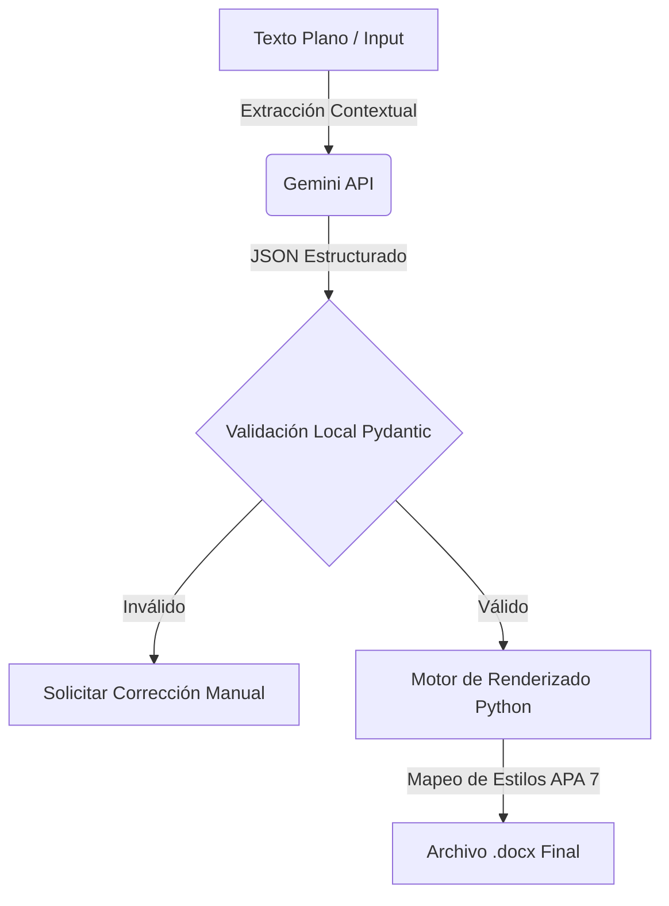

# Plan de Implementación: Sistema Generador APA Local-First

**Objetivo:** Crear un sistema de generación de documentos `docx` que reduzca el OPEX en un 95% mediante una arquitectura híbrida: Inteligencia en Cloud (Gemini) + Ejecución en Local (Python).

## 1. Arquitectura & Flujo de Datos

## 2. Componentes del Sistema

### [A] Backend (Inteligencia & Validación)
Ubicación: `Producto_1_Premium/Documentosprofesionales/backend/`

#### `schemas.py` (Pydantic Models)
Define la estructura exacta de los datos bibliográficos APA 7.
- **Author:** Manejo de listas, corporativos y anónimos.
- **Date:** Parsing de años, fechas completas y "s.f.".
- **Title:** Capitalización inteligente y manejo de cursivas.
- **Source:** Formateo de volúmenes, números y DOIs.

#### `extractor.py` (Gemini Client)
Cliente optimizado para `gemini-1.5-flash`.
- Prompt Engineering para salida JSON estricta.
- Gestión de retries y control de tokens.

### [B] Software (Motor de Renderizado)
Ubicación: `Producto_1_Premium/Documentosprofesionales/software/`

#### `renderer.py` (Python-Docx Engine)
Motor de construcción del documento.
- **Estilos:** Definición programática de estilos APA (Times New Roman 12, Interlineado 2.0, Sangría Francesa).
- **Inyección:** Algoritmo de inserción de citas en el flujo de texto (si se solicita) o lista de referencias final.

### [C] Salida
Ubicación: `Producto_1_Premium/Documentosprofesionales/salida/`
- Destino de los archivos generados.
- Logs de ejecución y validación.

## 3. Matriz de Lógica APA 7 (Implementación)

Se implementarán las siguientes reglas condicionales en el motor de renderizado:
- **Autor:** `if validation.is_corporate: print(name) else: print(surname, initials)`
- **Título:** `run.italic = True` si el tipo de fuente es "Libro" o "Informe".
- **Fuente:** `run.italic = True` para nombres de revistas. Concatenación inteligente de `Vol(Num)`.

## 4. Gestión de Riesgos (FinOps & Seguridad)

| Riesgo | Impacto | Estrategia de Mitigación |
| :--- | :--- | :--- |
| Costo de Tokens | Económico | Uso de `gemini-1.5-flash` y prompts minimalistas. Cacheo de requests repetidos. |
| Alucinación IA | Calidad | Paso intermedio de validación Pydantic + Revisión Humana (HITL). |
| Dependencias | Técnico | Entorno virtual aislado con versiones congeladas (`python-docx==1.1.0`). |
| Overhead de Validación | Mínimo | Despreciable (<1ms) gracias al core Rust de Pydantic. |
| Esquemas Rígidos | Medio | Configurar `extra='allow'` para capturar metadatos imprevistos de Gemini. |

## 5. Próximos Pasos (Validación de Usuario)
1. Confirmar API Key y configuración de entorno.
2. Aprobar esquema de datos Pydantic.
3. Ejecutar primera prueba de concepto (PoC).
